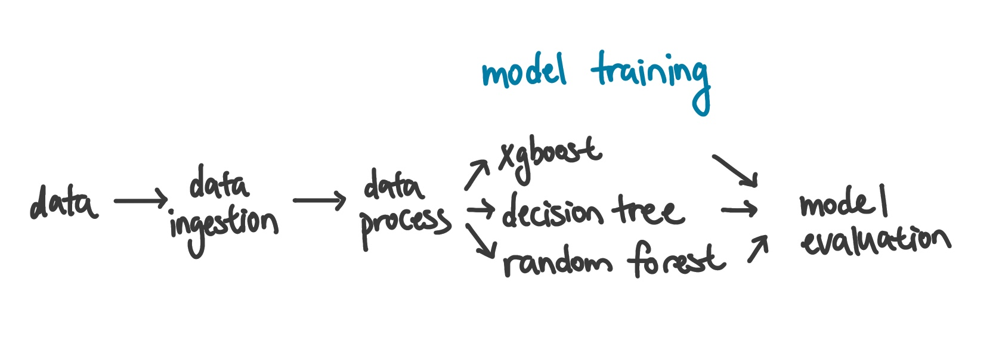
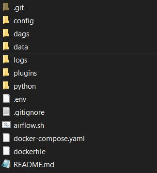
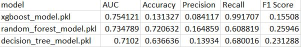
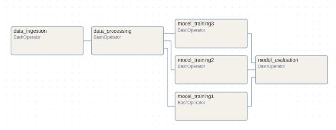
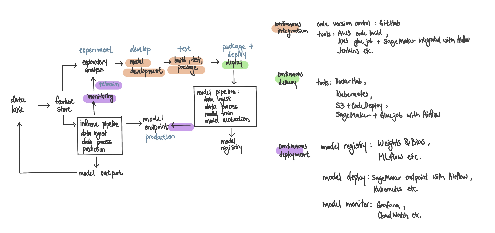

# mle-project

Objective Develop and present a machine learning project that includes data preprocessing, model training, pipeline orchestration, containerization, and (as a bonus) API development and CI/CD pipeline suggestion.
This README includes:
- Project Setup
- Docker Setup
- Dataset Selection & Model Training
- Workflow Automation Tools
- Containerization
- CI/CD Proposal
- Model Monitoring Strategies

## Project Setup
This repo includes the Dockerfile, EDA, data ingestion, data processing, model training, model evaluation, and airflow orchestration of the pipeline. Below is the pipeline set up:

Due to data size limitation on GitHub, please download the data folder provided via link provided by email and put the data folder under the root directory:

After following Docker Setup instructions #1-4 in the next section, the pipeline can be triggered by the following steps:
1. Go to http://localhost:8080
2. Use "airflow" as both username and password to log into airflow
3. Find ‘mlops_pipeline’ from the list, click the run button on the right
4. The pipeline should be triggered, wait for the entire process to finish
5. The results are stored in the /data folder
6. For clean up, refer to Docker Setup #5

## Docker Setup
If pulling from DockerHub, run the following:\
docker pull amyzli/airflow_custom:latest\
docker tag amyzli/airflow_custom:latest airflow_custom:latest\
docker rmi amyzli/airflow_custom:latest

Alternatively, if using dockerfile within this repo, to build new image:\
Build docker image from dockerfile (image name: airflow_custom:latest).\
If using terminal, cd to the folder where the dockerfile is located and run: docker build -t airflow-custom:latest .\

1. If using Linux, need to run: echo -e "AIRFLOW_UID=$(id -u)" > .env
2. To create first user account, run: docker compose up airflow-init
3. To start all services, run: docker compose up
4. Please keep the terminal where docker compose up was executed in
5. To clean up, run: docker compose down --volumes --rmi all 

For terminal access after the docker containers are up, do the following:\
6. For terminal access of the airflow container, run: ./airflow.sh bash\
7. For the list of all dags, run: airflow dags list\
8. For triggering the dag (dag_id should be mlops_pipeline), run: airflow dags trigger <dag_id>

## 1. Dataset Selection & Model Training
A. Dataset: Loan Defaulter dataset from kaggle: https://www.kaggle.com/datasets/gauravduttakiit/loan-defaulter

B. EDA: please see eda.ipynb

C. Data preprocessing: please see data_processing.py

D. Model training: please see model_train.py files, three algorithms are provided: XGBoost, Decision Tree, and Random Forest. Minimal hyperparameter tuning was done to minimize compute. 

E. Evaluation: please see model_evaluation.py file and evaluation_results.csv for metric outputs.\

Out of the three algorithms, the XGBoost model had the highest AUC score. In the case of loan defaults, recall score is more important than accuracy or precision since the defaulter percentage is relatively low in the population (8%), and false positives are tolerated. By comparing the AUC, precision, recall, and F1 scores between the XGBoost, Decision Tree, and Random Forest algorithms, XGBoost had the highest recall score and also AUC score, which suggests that it is the best in identifying defaulters. 

## 2. Workflow Automation Tools
Apache airflow is used to orchestrate data_ingestion.py, data_processing.py, model_evaluation.py, and the three model training scripts in parallel.\

## 3. Containerization
The project has been dockerized to include all necessary dependencies.

## 4. CI/CD Proposal
Below is the CI/CD proposal and possible tools to be used:\

## 5. Model Monitoring Strategies
Assuming new features come in and the model is scoring new loan applications on a daily basis, monitoring strategies can be set up on both the data quality side as well as model performance to ensure reliability in production. Monitoring is able to detect feature changes in production, model prediction drifts, and can signal issues in the ML pipeline. The drifts can be used to determine an appropriate time for model retrain, as well as provide insights to business cases. 

**Tools:**
One tool that can be easily integrated is Grafana. Specific metrics can be logged using Grafana and produce a dashboard to show data quality and model performance overtime. Alerts can be built into emails or Slack notifications to trigger investigation and retraining. If using the AWS environment, CloudWatch can be used to log appropriate metrics and create alerts, and SageMaker Model Monitor can be used to monitor data quality. 

**Data Quality Metrics:**
To monitor data quality (e.g. the quality of features for loan applications), various metrics can be monitored overtime and compared with historical values to ensure stability:
- Percentage of null values
- Feature value distribution, average, mean, mode, max, min
- JS divergence or statistical tests (KS test etc.)

**Model Stability Metrics:**
To monitor model stability, metrics can be monitored based on model scores. This will not only check for whether the model’s predictions are consistent, but also check for potential changes in the market and any significant changes with the input data.
- Score distribution, average, mean, mode, max, min
- JS divergence or statistical tests (KS test etc.)
- Feature importance - ensure feature importance stays relatively stable. In addition, client profiling based on feature importance can be tracked as well. For example, splitting clients into 10 deciles based on their prediction score, and calculate each decile’s average feature value for the top 10 features. 

**Model Performance Metrics:**
To monitor model performance, the ground truth label will need to be provided (whether the loan was defaulted). This often will lead to a lag in monitoring performance by several months depending on the time it takes for a loan to default and the time it takes to ingest the appropriate data. Metrics that can be monitored in this case are:
- AUC score, accuracy, F1, precision, recall etc. 

**Additional Metrics:**
Additional threshold or trigger-based monitoring can be used depending on feasibility. For example, if the average credit score for clients is below a certain threshold, then trigger an alert. This may be due to insufficient ingestion of credit union data or overall decrease in loan application quality.

